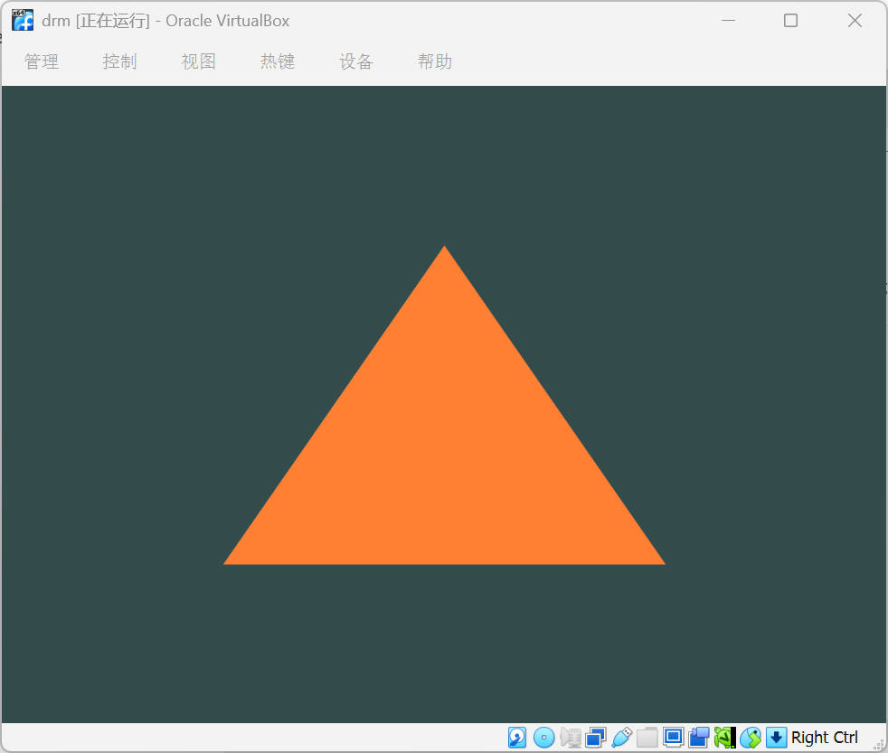
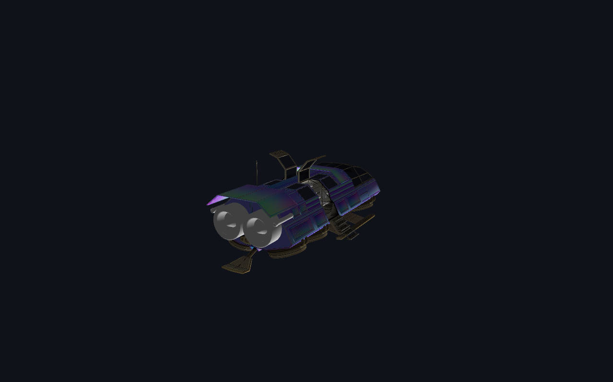
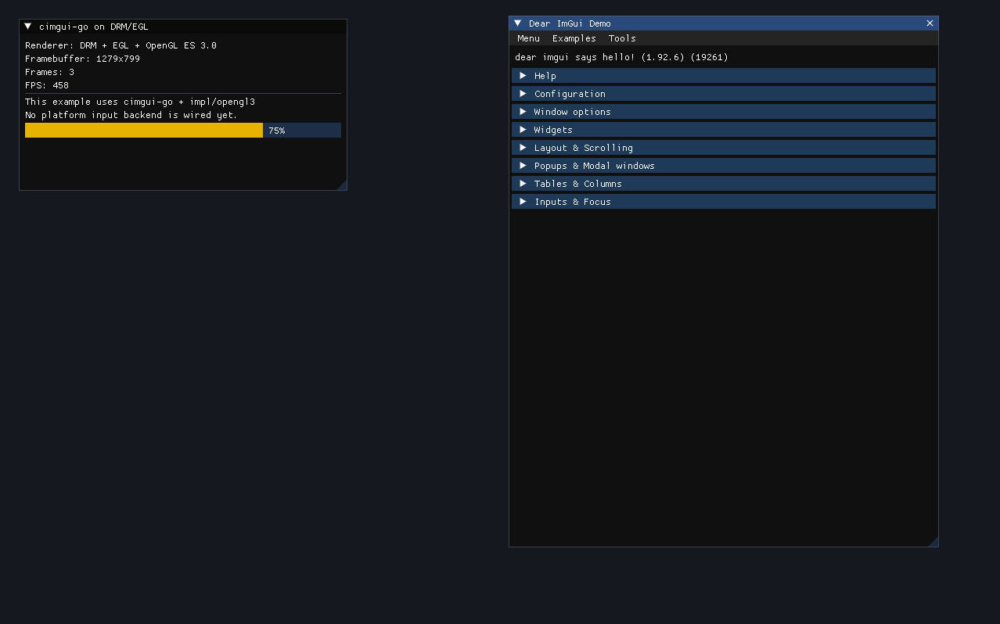

# go-drm-egl

[中文版本](./README.zh-CN.md)

`go-drm-egl` is a lightweight CGO wrapper for Go designed for GPU-accelerated rendering on embedded Linux systems such as Rockchip RK3568/RK3588 and Raspberry Pi, without requiring X11 or Wayland. It uses DRM/KMS and EGL directly to enable rendering immediately after boot.

## Features

* **No desktop dependency**: runs directly on a Linux TTY console.
* **Hardware acceleration**: supports GPU rendering through EGL and OpenGL ES.
* **Double buffering**: built-in DRM page flip support helps avoid tearing.
* **Cross-architecture support**: works on `amd64` and `arm64`.

## Environment Setup

### 1. System Dependencies
Before building and running, make sure the following development packages are installed.

**Ubuntu/Debian:**

```bash
sudo apt-get update
sudo apt-get install libdrm-dev libgbm-dev libegl1-mesa-dev libgles2-mesa-dev pkg-config
```

### 2. Hardware and Permissions
* **GPU support**: a GPU with a DRM/KMS driver is required.
* **Stop desktop services**: DRM usually needs exclusive access to the display device. If a desktop environment is running, stop it first:

```bash
sudo systemctl stop gdm    # or lightdm, sddm
```

* **Permissions**: running the program often requires `root`, or adding the user to the `video` group:

```bash
sudo usermod -aG video $USER
```

## Quick Start

### Install

```bash
go get github.com/tthhr/go-drm-egl
```

### Run Examples
The project currently includes four basic examples:

* `examples/triangle_test`: renders a simple triangle.
* `examples/texture_test`: creates, displays, and deletes a texture.
* `examples/model_test`: loads and displays the `car.glb` model.
* `examples/cimgui_test`: integrates `cimgui-go` on top of DRM/EGL.

Triangle example:

```bash
cd examples/triangle_test
go run main.go
```

Texture example:

```bash
cd examples/texture_test
go run main.go
```

Model example:

```bash
cd examples/model_test
go run main.go
```

cimgui-go example:

```bash
cd examples/cimgui_test
go run .
```

Run these examples in a local TTY session rather than over SSH or a remote desktop session.

## Screenshots
> Note: the screenshots below were captured in a PC virtual machine.

| Triangle Test | Model Test | cimgui-go Test |
| :---: | :---: | :---: |
|  |  |  |

## Project Structure
* `/drm`: core CGO logic for DRM initialization, GBM buffer management, and EGL context creation.
* `/examples`: sample programs showing initialization and rendering loops.

## Cross Compilation
Example for `arm64`:

```bash
CGO_ENABLED=1 \
GOOS=linux \
GOARCH=arm64 \
CC=aarch64-linux-gnu-gcc \
go build -o drm_demo_arm64 ./examples/triangle_test
```

If you are using an SDK generated by Buildroot or Yocto, the following script shows a typical setup to make CGO link against the correct ARM64 `libdrm` and `gbm` libraries.

```bash
#!/bin/bash

# === 1. Path configuration ===
SDK_PATH=/home/harry/rock/atk_rkx_linux/buildroot/output/rockchip_rk3568/host
SYSROOT=${SDK_PATH}/aarch64-buildroot-linux-gnu/sysroot

# === 2. Go cross-compilation settings ===
export GOOS=linux
export GOARCH=arm64
export CGO_ENABLED=1

# Cross compiler from the SDK
export CC=${SDK_PATH}/bin/aarch64-buildroot-linux-gnu-gcc

# === 3. Core CGO compile and link flags ===
export CGO_CFLAGS="--sysroot=${SYSROOT} -I${SYSROOT}/usr/include -I${SYSROOT}/usr/include/drm"
export CGO_LDFLAGS="--sysroot=${SYSROOT} -L${SYSROOT}/usr/lib -L${SYSROOT}/lib"

# If pkg-config is used, point it at the target sysroot
export PKG_CONFIG_PATH=${SYSROOT}/usr/lib/pkgconfig
export PKG_CONFIG_SYSROOT_DIR=${SYSROOT}

# === 4. Build ===
echo "Building ARM64 version..."
go build -o triangle_test ./examples/triangle_test
```

## License
MIT License
